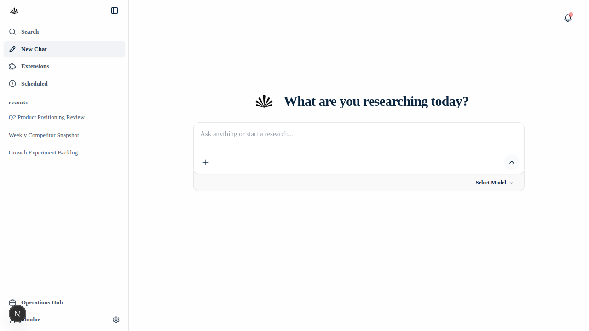
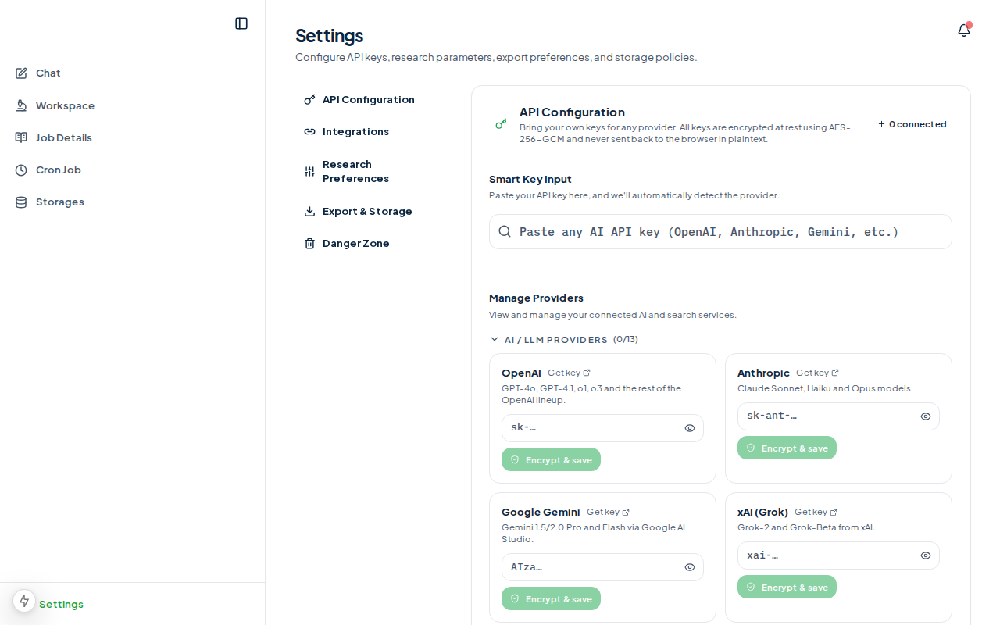

# Outlier

Outlier is a high-performance research engine designed to transform raw topics into fully-researched, structured insights with cited source evidence. Built for professional researchers, it automates the tedious parts of the discovery pipeline—from deep web searching to automated fact verification.

---

## ✨ Core Features

- **Autonomous Research Agents**: Leveraging advanced LLM models to scan the web, verify facts, and synthesize information in real-time.
- **Source Grounding**: Every insight generated includes direct links to source evidence, ensuring maximum accuracy and credibility.
- **Deep Web Search**: Integrated with industry-leading search providers including Tavily, Serper, Brave, and Exa.
- **Modern Desktop Experience**: Native desktop application powered by **Tauri 2.0**, offering a seamless, low-latency interface.
- **Flexible AI Integration**: Support for multiple LLM providers including OpenAI, Anthropic, Google Gemma, xAI (Grok), DeepSeek, and more.
- **Global Theme Management**: Custom workspace colors and system-native UI scaling for an optimized visual experience.

---

## 🛠️ Tech Stack

### Frontend & Core
- **Framework**: [Next.js 15](https://nextjs.org/) (App Router)
- **UI Library**: [React 19](https://react.dev/), [Tailwind CSS](https://tailwindcss.com/)
- **Language**: [TypeScript](https://www.typescriptlang.org/)
- **Icons**: [Hugeicons](https://hugeicons.com/) (using `@hugeicons/react` and `@hugeicons/core-free-icons`)
- **State Management**: React Hook Form & Zod for schema validation

### Backend & Orchestration
- **Queue & Workers**: [BullMQ](https://bullmq.io/) / [Redis](https://redis.io/)
- **Database & Auth**: [Supabase](https://supabase.com/)
- **Testing**: [Vitest](https://vitest.dev/)

### Desktop Shell
- **Runtime**: [Tauri 2.0](https://v2.tauri.app/)
- **Sidecar**: Node.js standalone sidecar for Next.js backend execution

---

## 📸 Screenshots

| New Research | Settings & Integrations |
|--------------|-------------------------|
|  |  |

---

## 🚀 Quick Start

### 1. Clone the repository
```bash
git clone <repository-url>
cd outlier
```

### 2. Install dependencies
```bash
npm install
```

### 3. Environment Setup
Create a `.env` file in the root directory. Outlier dynamically falls back to in-memory adapters if credentials are missing, but for full functionality, configure the following:

| Variable | Description |
|----------|-------------|
| `ANTHROPIC_API_KEY` | API key for Claude models |
| `TAVILY_API_KEY` | Primary web search API key |
| `SUPABASE_URL` | Your Supabase project URL |
| `SUPABASE_SERVICE_ROLE_KEY` | Supabase service role key |
| `REDIS_URL` | Redis connection string (e.g., Upstash) |

### 4. Run the development server
```bash
npm run dev
```
Open [http://localhost:4028](http://localhost:4028) to see the application.

---

## 🖥️ Desktop App (Tauri 2.0)

Outlier ships as a cross-platform desktop application. It utilizes a hybrid architecture where the Next.js standalone server runs as a Node.js sidecar, communicating with the Tauri webview via a dynamically allocated localhost port.

### Development Mode
```bash
npm run tauri:dev
```
This boots the Next.js dev server and points the Tauri webview at it with full Hot Module Replacement (HMR) support.

### Production Build
```bash
npm run tauri:build
```
This command performs a full production build:
1. Generates the Next.js standalone artifact.
2. Prepares the Node.js sidecar for the target platform.
3. Bundles everything into a platform-native installer (`.dmg`, `.msi`, `.deb`, etc.).

---

## 🧪 Development & Testing

- `npm run type-check`: Runs TypeScript compiler checks.
- `npm run test`: Runs the test suite using Vitest.
- `npm run lint`: Checks for linting errors.
- `npm run format`: Formats code using Prettier.

---

Built with ❤️ for professional researchers.
