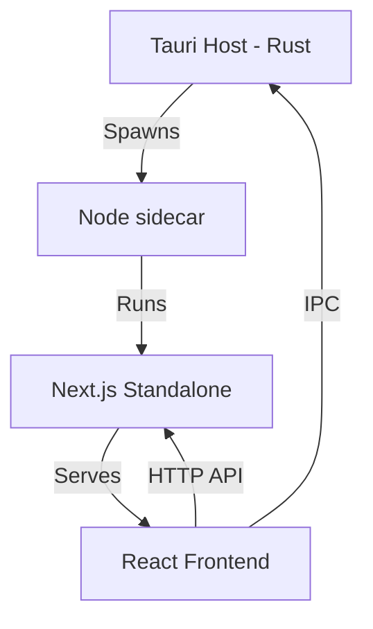

# Migration Analysis Report (Phase 0)

## 1. Repository Architecture Map

### Current Architecture: Tauri + Next.js (App Router) + Node.js Sidecar
- **Frontend**: Next.js 15 (React 19) using App Router.
  - Components in `src/components`, `src/app`.
  - Styling: Tailwind CSS.
  - State: React hooks, `@tauri-apps/plugin-store` for persistence.
- **Backend**: Next.js API Routes (`src/app/api/`) calling into a singleton backend instance.
  - Core logic in `src/server/`.
  - Dependency Injection in `src/server/bootstrap.ts`.
- **Sidecar**: Custom Node.js runtime bundled with the app.
  - Production: Spawns Node to run Next.js standalone server.
  - Development: Points to `next dev` server.

### Runtime Boundaries
1. **Host Process (Rust)**: Tauri 2.0 shell. Manages window, system menu, and sidecar lifecycle.
2. **Sidecar Process (Node.js)**: Runs the Next.js server logic, AI orchestration, and background jobs.
3. **Webview (JavaScript/React)**: Renders the UI and communicates with the Sidecar via HTTP (localhost) and the Host via Tauri IPC.

## 2. Dependency Analysis

### Next.js-only Dependencies
- `next`
- `eslint-config-next`
- `@netlify/plugin-nextjs`

### Server-only Logic
- `src/server/`: AI agents, search providers, job queues, repositories.
- `src/app/api/`: REST endpoints.
- `zod`: Used for both frontend/backend validation (can be kept).

### Tauri Integration Points
- `src-tauri/src/lib.rs`: Sidecar spawning, window navigation.
- `src/lib/useZoom.ts`: Calls `@tauri-apps/api/webviewWindow`.
- `src/lib/api-keys-store.ts`: Calls `@tauri-apps/plugin-store`.
- `src/components/Updater.tsx`: Calls `@tauri-apps/plugin-updater`.

## 3. Runtime Graph

## 4. Startup Sequence
1. **Tauri Entry**: `main.rs` -> `lib.rs` -> `run()`.
2. **Setup**:
   - (Release) `spawn_sidecar()`:
     - Downloads/Locates Node binary.
     - Spawns `sidecar/start-sidecar.js`.
     - Sidecar starts Next.js on dynamic port.
     - Sidecar prints `READY:URL`.
     - Rust parses URL and navigates webview.
   - (Debug) `tauri.conf.json` points to `http://localhost:4028`.
3. **Frontend Boot**: React hydrates, checks for updates, loads settings from Store.

## 5. Migration Risk Report

| Risk | Impact | Mitigation |
| :--- | :--- | :--- |
| AI Orchestration Complexity | High | Port `src/server/agent` logic to Rust using `reqwest` for API calls and `tokio` for async orchestration. Maintain interface parity. |
| Next.js App Router -> Vite | Medium | Replace `next/navigation` and `next/link`. Flatten routing if possible or use `react-router`. |
| SSE / PubSub | Medium | Replace `src/server/pubsub` (currently custom SSE) with Tauri's native Event system. |
| Job Queue | Medium | Move `MemoryJobQueue` to a Rust-based async queue (e.g., using `tokio` channels). |
| Build Pipeline | Low | Update `tauri.conf.json` to use Vite build output instead of sidecar. |

## 6. Bundle-Size Analysis (Estimate)
- **Current**: Next.js Standalone + Node Binary (~50MB for Node + ~20MB for Next.js artifacts).
- **Target**: Vite SPA (~5-10MB) + Rust Binary (~10-20MB).
- **Expected Reduction**: ~50% - 70% reduction in install size and memory usage.
